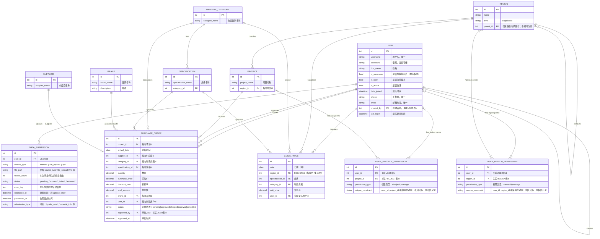

```mermaid
erDiagram
    USER ||--o{ DATA_SUBMISSION : "uploads"
    USER ||--o{ PURCHASE_ORDER : "creates"
    USER ||--o{ GUIDE_PRICE : "manages"
    USER ||--o{ PURCHASE_ORDER : "approves"
    USER ||--o{ USER : "creates"
    USER }|--|{ USER_PROJECT_PERMISSION : "has project perms"
    USER }|--|{ USER_REGION_PERMISSION : "has region perms"
    
    PROJECT }|--|{ USER_PROJECT_PERMISSION : "has user perms"
    PROJECT ||--o{ PURCHASE_ORDER : "includes"
    REGION ||--o{ PROJECT : "contains"
    
    REGION }|--|{ USER_REGION_PERMISSION : "has user perms"
    REGION ||--o{ GUIDE_PRICE : "has prices"
    REGION ||--o{ REGION : "contains"
    
    MATERIAL_CATEGORY ||--o{ SPECIFICATION : "has"
    MATERIAL_CATEGORY ||--o{ PURCHASE_ORDER : "categorizes"
    MATERIAL_CATEGORY ||--o{ GUIDE_PRICE : "priced"
    
    SPECIFICATION ||--o{ PURCHASE_ORDER : "specifies"
    SPECIFICATION ||--o{ GUIDE_PRICE : "specified"
    
    BRAND ||--o{ PURCHASE_ORDER : "associated_with"
    
    SUPPLIER ||--o{ PURCHASE_ORDER : "supplies"
    
    REGION {
        int id PK
        string name
        string level  "city|district"
        int parent_id FK "仅区县指向所属市；市级可为空"
    }

    GUIDE_PRICE {
        int id PK
        date date  "日期（月）"
        int region_id FK "REGION.id（指向市 或 区县）"
        int specification_id FK "规格"
        int category_id FK "物资类别"
        decimal unit_price  "信息价"
        int user_id FK "指向录入用户id"
    }

    USER {
        int id PK
        string username  "用户名，唯一"
        string password  "密码，加密存储"
        string first_name  "姓名"
        bool is_superuser  "是否为超级用户（最高权限）"
        bool is_staff  "是否为管理员"
        bool is_active  "是否激活"
        datetime date_joined  "加入时间"
        string phone  "手机号，唯一"
        string email  "邮箱地址，唯一"
        int created_by FK "创建者ID，关联USER表id"
        datetime last_login  "最后登录时间"
    }

    USER_PROJECT_PERMISSION {
        int id PK
        int user_id FK "关联USER表id"
        int project_id FK "关联PROJECT表id"
        string permission_type  "权限类型：view|edit|manage"
        string unique_constraint "user_id, project_id 确保用户对同一项目只有一条权限记录"
    }

    USER_REGION_PERMISSION {
        int id PK
        int user_id FK "关联USER表id"
        int region_id FK "关联REGION表id"
        string permission_type  "权限类型：view|edit|manage"
        string unique_constraint "user_id, region_id 确保用户对同一地区只有一条权限记录"
    }

    MATERIAL_CATEGORY {
        int id PK
        string category_name  "物资类别名称"
    }

    SPECIFICATION {
        int id PK
        string specification_name  "规格名称"
        int category_id FK
    }

    BRAND {
        int id PK
        string brand_name  "品牌名称"
        string description  "描述"
    }

    PROJECT {
        int id PK
        string project_name  "项目名称"
        int region_id FK "指向地区id"
    }
    
    SUPPLIER {
        int id PK
        string supplier_name  "供应商名称"
    }

    PURCHASE_ORDER {
        int id PK
        int project_id FK "指向项目id"
        date arrival_date  "到货时间"
        int supplier_id FK "指向供应商id"
        int category_id FK "指向物资类别id"
        int specification_id FK "指向规格id"
        decimal quantity  "数量"
        decimal purchase_price  "采购价"
        decimal discount_rate  "折扣率"
        decimal total_amount  "总金额"
        int brand_id FK  "指向品牌id"
        int user_id FK  "指向创建用户id"
        string status  "订单状态：pending|approved|shipped|received|cancelled"
        int approved_by FK "审批人ID，关联USER表id"
        datetime approved_at  "审批时间"
    }

    DATA_SUBMISSION {
        int id PK
        int user_id FK "USER.id"
        string source_type  "'manual' | 'file_upload' | 'api'"
        string file_path  "仅当 source_type=file_upload 时有值"
        int record_count  "本次填报/导入的记录条数"
        string status  "'pending', 'success', 'failed', 'reviewed'"
        text error_log  "导入失败时的错误信息"
        datetime submitted_at  "填报时间（原 upload_time）"
        datetime processed_at  "处理完成时间"
        string submission_type  "可选：'guide_price', 'material_info' 等"
    }
```